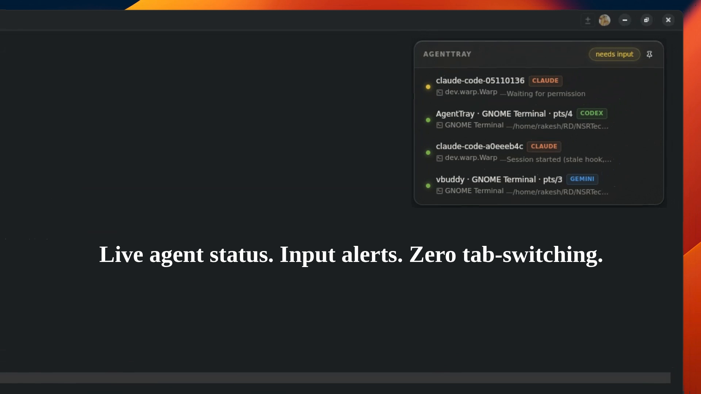

# AgentTray

Desktop tray app that alerts you when Claude Code, Codex CLI, or Gemini CLI pauses for input.

[](https://github.com/sprklai/agenttray/releases/latest)
[](LICENSE)
[](https://tauri.app)

I built AgentTray because I kept missing prompts from long-running agent sessions in another terminal. It sits in the tray, changes color when a session needs input, and opens a small popup with the sessions it can see. If your terminal exposes enough focus metadata, the popup can jump back to it.

- Hook-based prompt alerts for Claude Code, Codex CLI, and Gemini CLI
- Process scanning when hooks are not installed
- Native desktop notifications plus a tray status dot
- No daemon and no hosted backend; status files live in `~/.agent-monitor/`

<p align="center">
  
</p>
<p align="center">
  
</p>

## Why It Exists

The problem is not whether AI CLIs can notify you at all. The problem is that long agent sessions disappear behind other work. Notifications stack up, get dismissed, or arrive when you are deep in another window.

What I wanted was something quieter than another popup and easier to trust at a glance than a stack of notifications.

## What It Does

- `needs-input` / yellow: the agent is waiting on you
- `error` / red: the session failed
- `working` / blue: the agent is actively doing work
- `idle` / green: the agent is still running but mostly quiet
- `offline` / gray: nothing is currently detected

Hooks give AgentTray better state changes. Without hooks, it falls back to process scanning so you can still see active sessions.

## Quick Start

The most reliable setup today is from source because the hook installers currently live in this repo.

### Full Setup With Hooks

```bash
git clone https://github.com/sprklai/agenttray.git
cd agenttray
bun install
./scripts/hooks/install-hooks.sh all
cargo tauri dev
```

Requirements:

- [Rust](https://rustup.rs/) stable
- [Bun](https://bun.sh/)
- Tauri CLI: `cargo install tauri-cli`
- `jq` for `install-hooks.sh`
- Ubuntu/Debian system packages:
  ```bash
  sudo apt install libwebkit2gtk-4.1-dev libappindicator3-dev librsvg2-dev patchelf
  ```

### Prebuilt App Only

If you only want scan-based detection, download a build from the [releases page](https://github.com/sprklai/agenttray/releases/latest) and run it.

Hook installation is still script-based:

- Unix: `./scripts/hooks/install-hooks.sh all`
- Windows: `.\scripts\hooks\install-hooks.ps1 -Target all`

## Compatibility

| Area | Current status |
| --- | --- |
| Supported CLIs | Claude Code, Codex CLI, Gemini CLI |
| Hook-based updates | Supported for all three CLIs |
| Scan-based detection | Supported for all three CLIs |
| Linux | Used most during development |
| macOS | Supported in code, less tested than Linux |
| Windows | Supported in code, less tested than Linux |
| Terminal focus | Works for supported terminals and multiplexers; otherwise monitoring still works without focus |

Detailed matrix: [docs/compatibility.md](docs/compatibility.md)

## Use Cases

- Monitor a long Codex run while working in another window
- See when Claude Code is waiting on permission or input
- Keep multiple agent sessions visible across terminals
- Wrap an unsupported CLI and still get file-based status updates

Examples: [docs/use-cases.md](docs/use-cases.md)

## FAQ

### Why not just rely on built-in notifications?

Because notifications disappear. The tray does not.

### Does AgentTray send my prompts anywhere?

No. AgentTray watches local status files in `~/.agent-monitor/` and local process metadata. There is no hosted service in the current setup.

### Do I need hooks?

No. Hooks work better, but they are optional. Without them, AgentTray still detects running agent processes and basic state changes via scanning.

### What if my CLI is not supported?

You can use the wrapper scripts documented in [scripts/README.md](scripts/README.md) to report file-based status for custom or unsupported commands.

## Current Limitations

- Linux is still the platform used most during development.
- Hook installation is script-first today, not yet a polished in-app onboarding flow.
- Terminal focus depends on the terminal or multiplexer exposing enough metadata to target the right session.

## Docs

- [Compatibility matrix](docs/compatibility.md)
- [Use cases](docs/use-cases.md)
- [Script usage](scripts/README.md)
- [Contributing](CONTRIBUTING.md)
- [Security policy](SECURITY.md)

## Contributing

If you want to help, the biggest gaps right now are:

- new CLI hook integrations
- more terminal focusers
- macOS and Windows validation
- onboarding and docs polish

Start with [CONTRIBUTING.md](CONTRIBUTING.md) and the open [`help wanted`](https://github.com/sprklai/agenttray/issues?q=is%3Aopen+label%3A%22help+wanted%22) or [`good first issue`](https://github.com/sprklai/agenttray/issues?q=is%3Aopen+label%3A%22good+first+issue%22) labels.

## License

MIT
